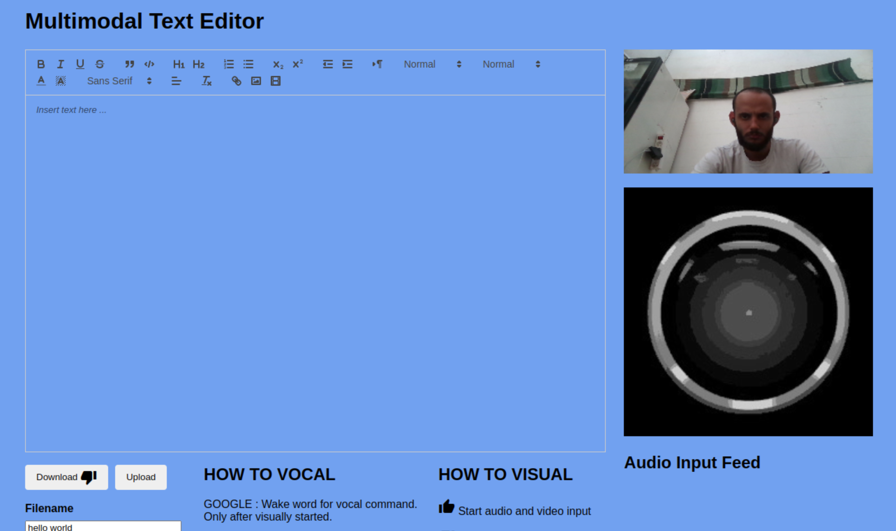

# Multimodal Quill Text Editor





# Introduction

This is a very basic Angular Application built around the Quill Text Editor. I added vocal and visual modalities with the help of the Web Speech API and Mediapipe. Five vocal controls are available and speech to text editing is also allowed. Five visual interactions are possible.

# Hands Semaphores Model

A simple 2-layer MLP is used to map hand landmarks to 6 possible classes. The model was built with Pytorch and trained over 3000 samples of hand landmarks gathered by myself using OpenCV and Mediapipe.

To collect data and train the model you can go under the gesture-recognition-model folder and install all the dependencies:

```shell
pip install -r requirements.txt
```

Once the model training is done, it is converted to ONNX format to be deployed in the browser.

# Angular Application

Install the dependencies:

```shell
npm install
```

Run the application on port 4200:

```shell
npm run start
```

## Controls

Two how to guides are provided both for the visual and vocal controls.

The thumb up starts both modalities.

The open hand stops them.

Saying GOOGLE starts the other voice controls.